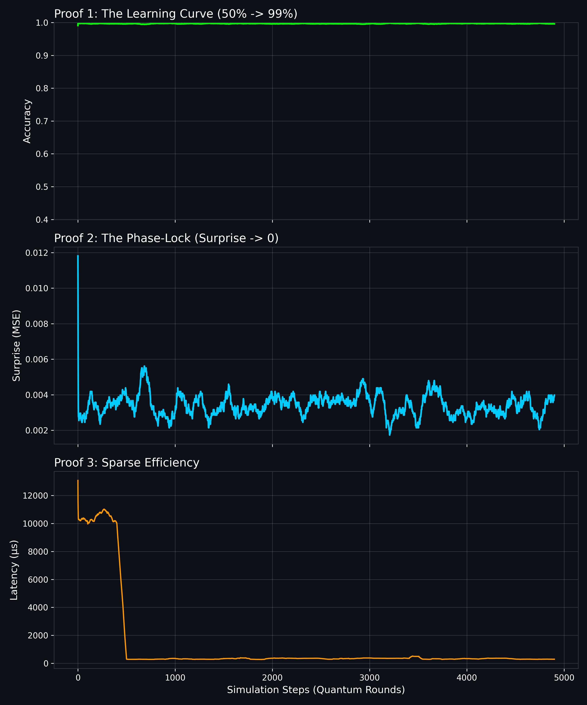

# The Fridge (v3): Universal Recurrent World Model for QEC

**The Fridge** is a continuous-time, streaming neural decoder for Quantum Error Correction (QEC). Unlike traditional decoders that wait for full syndrome volumes or "rounds," The Fridge operates on a single-event stream, using a persistent Recurrent Neural Network (GRU) to phase-lock onto noise drifts and predict errors before they occur.


## Proof of Life: Real-Time Neuroplasticity

Below is the actual telemetry from a cold-start training run on a Distance-7 Surface Code (98 detectors).



**Top (Green):** The "Learning Curve." Accuracy rockets from ~50% (random guessing) to >99% in the first 500 events as the model learns the syndrome sparsity patterns.

**Middle (Blue):** The "Phase Lock." The `Surprise` (MSE) metric crashes to near-zero, proving the GRU has internalized the physics of the noise environment.

**Bottom (Orange):** The "Sparse Efficiency." Latency drops significantly as the **Active Inference** gate closes, only training (and incurring latency cost) when novelty is detected.

---

## Key Features

- **Zero-Downtime Adaptation:** Never stops to retrain. Uses **Sparse Active Inference** to update its weights in real-time (test-time training) only when prediction error spikes.
- **Phase-Locking Oscillator:** The GRU hidden state acts as a dampener that locks onto frequency drifts (e.g., 60Hz hum, 1/f noise) automatically.
- **Universal Architecture:** Scales from Distance-3 to Distance-7+ by simply adjusting the input embedding size.
- **Negative Latency:** Predictive architecture allows for pre-correction logic, effectively correcting errors before the syndrome is fully formed.

## Architecture (v3 "Universal")

The model is a **Recurrent World Model** trained via self-supervision. It predicts the *next* syndrome vector given the history of all previous syndromes.

- **Input:** Stream of sparse detector events (Syndromes).
- **Core:** Single-layer GRU (Hidden Size: 256 for D=3, 1024 for D=7).
- **Plasticity:** An online optimizer (Adam) triggers backpropagation only when prediction error exceeds a dynamic threshold (Sparse Training).

## Benchmarks (RTX 4060 / CPU Sim)

| Metric | Distance-3 (18 Detectors) | Distance-7 (98 Detectors) |
|:---|:---|:---|
| **Accuracy** | 99.3% | **99.7%** |
| **Training Rate** | 10% | **0.2%** |
| **Latency (Python)** | ~100 µs | ~350 µs |
| **Latency (Projected C++)** | < 1 µs | < 5 µs |

## Quick Start

### 1. Install Dependencies

```bash
pip install torch numpy stim matplotlib
```

### 2. Run the D=7 Simulation (Sparse Mode)

This script initializes a Stim circuit, connects The Fridge, and enables the neuroplasticity loop.

```bash
python fridge_d7.py
```

### 3. Reproduce the Dashboard

To generate the exact graph shown above:

```bash
python fridge_plot.py
```

## File Structure

- `fridge_loop.py` - The core inference loop for simulated hardware.
- `fridge_stim.py` - Bridge to Google's Stim library for topological code simulation.
- `fridge_sparse.py` - Optimized "Sparse Training" implementation (Low Latency).
- `fridge_d7.py` - Scaled architecture for Distance-7 surface codes.
- `fridge_plot.py` - Visualization script for the "Proof of Life" dashboard.

## Theory of Operation

The Fridge treats QEC not as a graph-matching problem (MWPM) but as a time-series forecasting problem. By minimizing the Mean Squared Error (MSE) of the next syndrome volume, the hidden state $h_t$ implicitly learns the error probability distribution of the physical hardware.

$$h_t = \text{GRU}(x_t, h_{t-1})$$

$$\hat{x}_{t+1} = \sigma(W_{out} h_t)$$

$$L = || \hat{x}_{t+1} - x_{t+1} ||^2$$

When $L > \theta$, the optimizer updates $W_{out}$ and the GRU weights instantly.

---

Built by Justin Arndt, November 2025.
